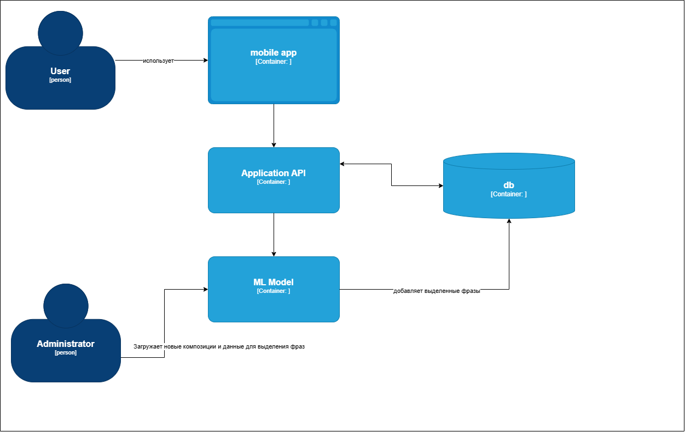
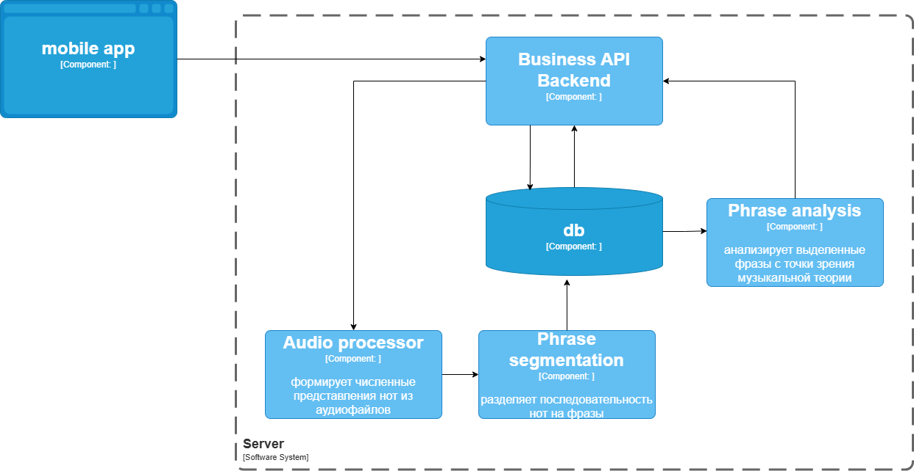

# Jazz Phrase Segmentation AI

Мобильное приложение для обучения джазовой импровизации: выделяет паттерны гармонии и рекомендует контекстно подходящие фразы из соло известных джазовых музыкантов. Ключевая идея — с помощью модели машинного обучения разбивать последовательность нот на музыкальные фразы, чтобы пополнять базу рекомендаций автоматически.

В данном репозитории представлена ML и backend часть проекта.

## Модель машинного обучения
- Задача: бинарная классификация по нотам (начало фразы vs продолжение)
- Данные: Weimar Jazz Database (456 соло, 11 082 фразы)
- Архитектура: Bi‑LSTM + Self‑Attention
- Фичи: высота/длительность/громкость/метрический вес, интервалы и паузы, лог‑преобразования и нормализации
- Обучение: взвешенная cross‑entropy, AdamW, LR warmup+decay, dropout, early stopping

## Обработка данных
- Очистка и обработка аномалий: заполнение пропусков (например, loud_max), замена бесконечных и NaN значений, нормализации и лог‑преобразования для сглаживания распределений.
- Инжиниринг признаков: относительные онсеты и длительности, нормализованные интервалы и направление движения, комбинированные признаки паузы и межнотных интервалов, метрика ритмической сложности и метрический вес.
- Масштабирование: стандартное масштабирование признаков (StandardScaler) перед обучением.
- Разбиение данных: стратифицированное разделение на train/val/test = 70%/15%/15% по сложности (число фраз в мелодии), чтобы сбалансировать стили и длины соло.

## Обучение нейронной сети
- Функция потерь: взвешенная перекрёстная энтропия для компенсации дисбаланса классов; дополнительное внимание к контексту вокруг начала фразы с помощью убывающих весов по расстоянию.
- Оптимизация: AdamW (L2=0.01), batch=64, до 200 эпох, начальный LR=0.0003, планировщик LambdaLR с разогревом и линейным затуханием.
- Регуляризация и стабильность: dropout=0.3, ранняя остановка (patience=15, сохранение лучшей модели), Xavier uniform для линейных слоёв и ортогональная инициализация рекуррентных весов LSTM.
  
Обучение проводилось в среде Kaggle (GPU-ноутбуки); воспроизводимый код и скрипты находятся в core/ml/kaggle:
- prepare_kaggle_data.py — подготовка данных и признаков
- train_kaggle_model.py — запуск обучения модели
- evaluate_kaggle_model.py — оценка на тестовом наборе

## Результаты модели
- Loss: 0.1142  
- Precision: 0.8966  
- Recall: 0.8302  
- F1: 0.8621  
- Accuracy: 0.9859

Фокус на высокой точности для корректных границ фраз.

## Архитектура приложения

<p align="center">
  <br/>
  Диаграмма контейнеров
</p>

<p align="center">
  <br/>
  Диаграмма компонентов
</p>

## API
- GET /api/songs  
  Пагинированный список песен с поиском по названию.  
  Параметры: `q` (опционально), `limit` (по умолчанию 20), `offset` (по умолчанию 0).  
  Ответ: `{ total, items: [{ id, title }] }`.

- GET /api/songs/{song_id}/chords  
  Аккордовая последовательность песни.  
  Параметры пути: `song_id` (обязателен).  
  Ответ: `{ song_id, title, bars: [{ id, number, time_signature, chords, section }] }`.

- GET /api/songs/{song_id}/patterns  
  Найденные гармонические паттерны для песни.  
  Параметры пути: `song_id` (обязателен).  
  Ответ: `{ song_id, title, patterns: [{ type, key, bar_ids: [..], normalized_chords: [{ chord, duration }], features: [...] }] }`.

- POST /api/recommendations/phrases  
  Рекомендации фраз под заданный паттерн.  
  Тело: `{ features: [...] }` (числовой вектор признаков паттерна).  
  Ответ: `{ items: [{ melid, first_note_id, last_note_id, score, chords }] }`.

- GET /api/phrases/{melid}/notes  
  Ноты выбранной фразы для воспроизведения.  
  Параметры пути: `melid` (обязателен).  
  Параметры запроса: `first_note_id`, `last_note_id` (оба обязательны).  
  Ответ: `{ notes: [{ pitch, onset, duration, loudness }] }`.

## Структура репозитория

  ```├─ requirements.txt # Зависимости Python
  ├─ run_parser.py # CLI: запуск парсера/анализа гармонии
  ├─ preprocess_phrases.py # Предрасчёт фич фраз и заполнение кэша
  
  ├─ assets/
  │ ├─ C4-container.drawio.png # Диаграмма контейнеров (архитектура)
  │ └─ C4-component.drawio.png # Диаграмма компонентов (архитектура)
  
  ├─ api/ # REST API (сервер)
  │ ├─ main.py # Точка входа ASGI-приложения
  │ ├─ dependencies.py # DI/конфиг, подключения к сервисам/БД
  │ ├─ schemas.py # Pydantic-схемы запросов/ответов
  │ └─ routes/ # Маршруты API
  │ ├─ songs.py # /api/songs, /api/songs/{id}/chords, /patterns
  │ ├─ recommendations.py # /api/recommendations/phrases
  │ └─ phrases.py # /api/phrases/{melid}/notes
  
  ├─ core/ # Доменная логика и ML-компоненты
  │ ├─ ml/kaggle/ # Скрипты подготовки/обучения/оценки модели
  │ │ ├─ cache/ # Промежуточные файлы/артефакты
  │ │ ├─ prepare_kaggle_data.py # Подготовка датасета и фичей
  │ │ ├─ train_kaggle_model.py # Обучение Bi‑LSTM + Self‑Attention
  │ │ └─ evaluate_kaggle_model.py # Оценка метрик на тесте
  │ ├─ pattern_analysis/ # Анализ аккордовых последовательностей
  │ │ ├─ harmony_analyzer.py # Разбор аккордов, интервалы, поиск паттернов
  │ │ ├─ parser.py # Парсер аккордов/разметки из источников
  │ │ ├─ patterns.py # Описание шаблонов прогрессий
  │ │ ├─ pattern_manager.py # Управление обнаруженными паттернами
  │ │ ├─ phrase_manager.py # Извлечение/контекст фраз, подготовка к сравнению
  │ │ └─ models.py # DTO/структуры данных (ChordInfo и пр.)
  │ └─ utils/ # Утилиты общего назначения
  │ ├─ similarity_utils.py # Метрики/косинусное сходство и вспомогательные функции
  │ └─ init.py
  
  └─ .gitignore # Исключения для Git
```

## Запуск
